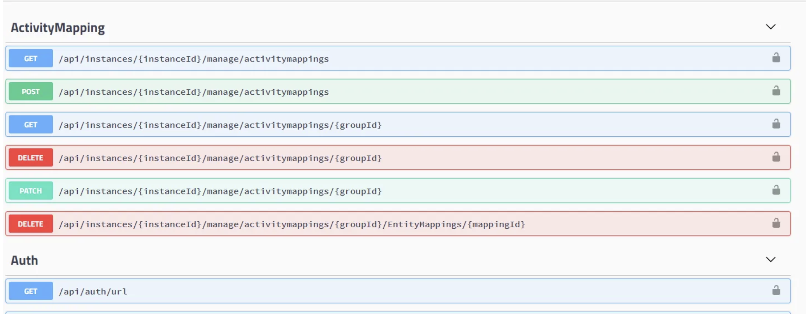
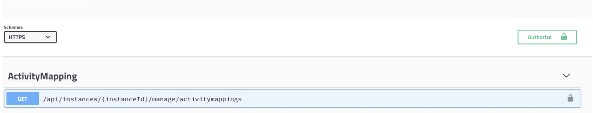
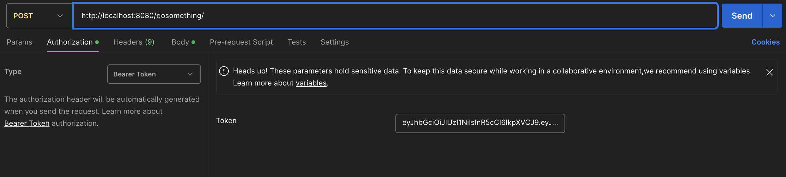

**1.Run BankV2Application**

Get response header with token, try to Post this url

**On App Bank Service**
```Postman test converter
Get : http://localhost:8080/conv-to/30/fr
```

**On Auth Micro Service**
```Postman test login
Post : http://localhost:8080/login/   
Json Raw: 
{
 "email": "test@test.fr",
 "password": "testtesttest"
}
```


**Lunch Test**

Right click on test directory and execute all

**Swagger**

It is also possible to use swagger available at the following url.
```Url
http://localhost:3000/api/   
```
Each box represents the controllers grouped by section.

<div align="center">
  <a>
    
  </a>
</div>

A small lock is available at the top right of the page, you will need to copy and paste the token of a register or login to access the controller protected by an auth guard

<div align="center">
  <a>
    
  </a>
</div>

Or use Postman like usual without forgetting to pass the token in the shepherd token value of the header

<div align="center">
  <a>
    
  </a>
</div>